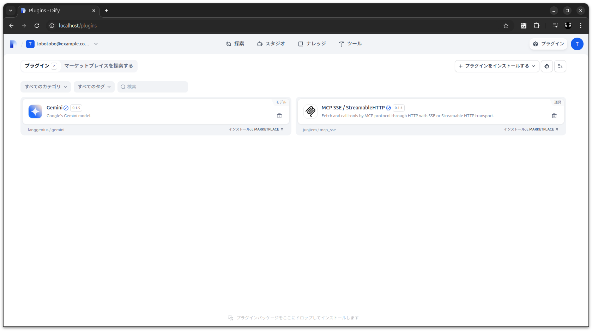
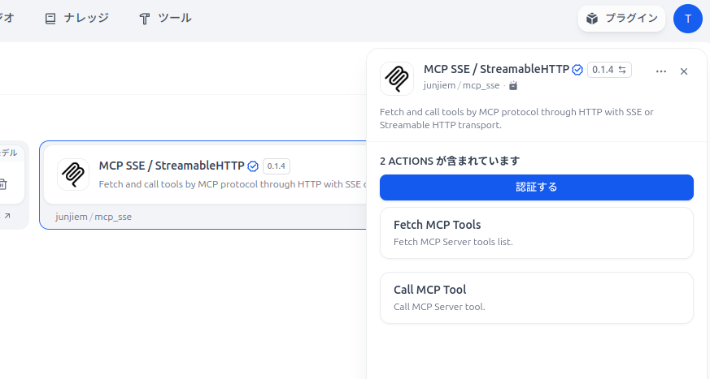
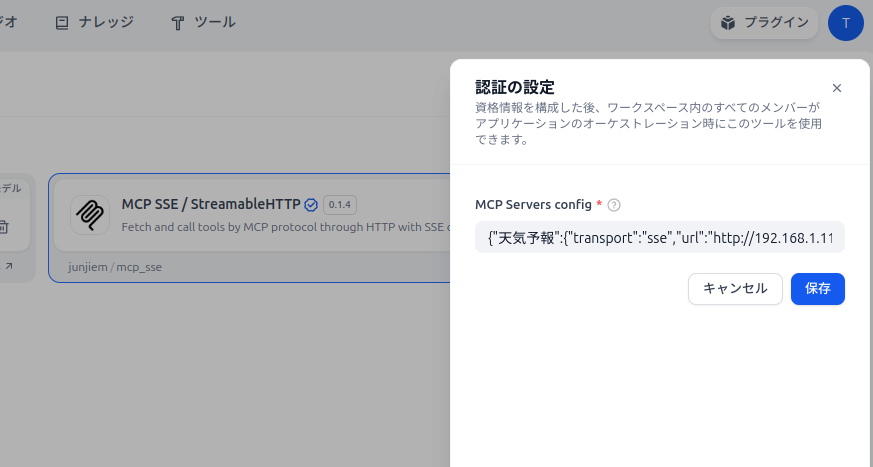
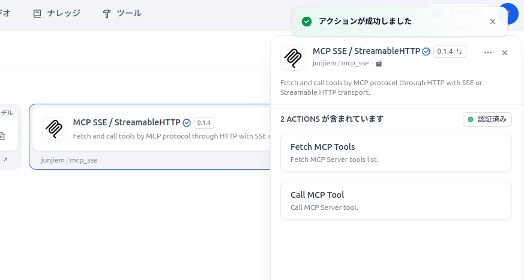
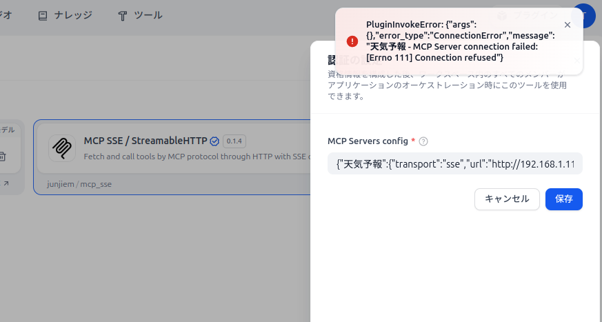
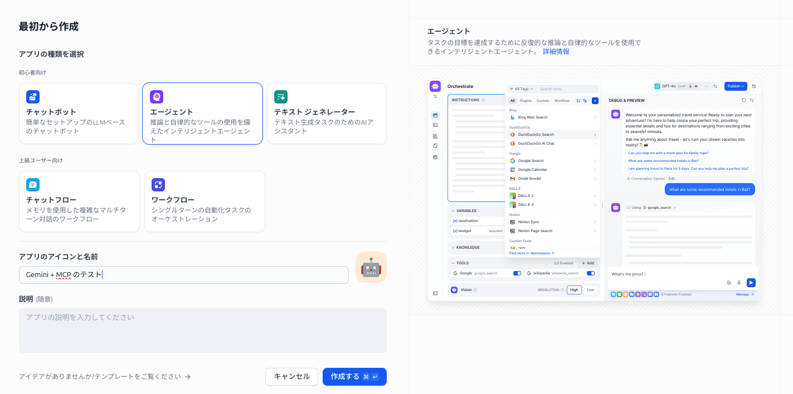
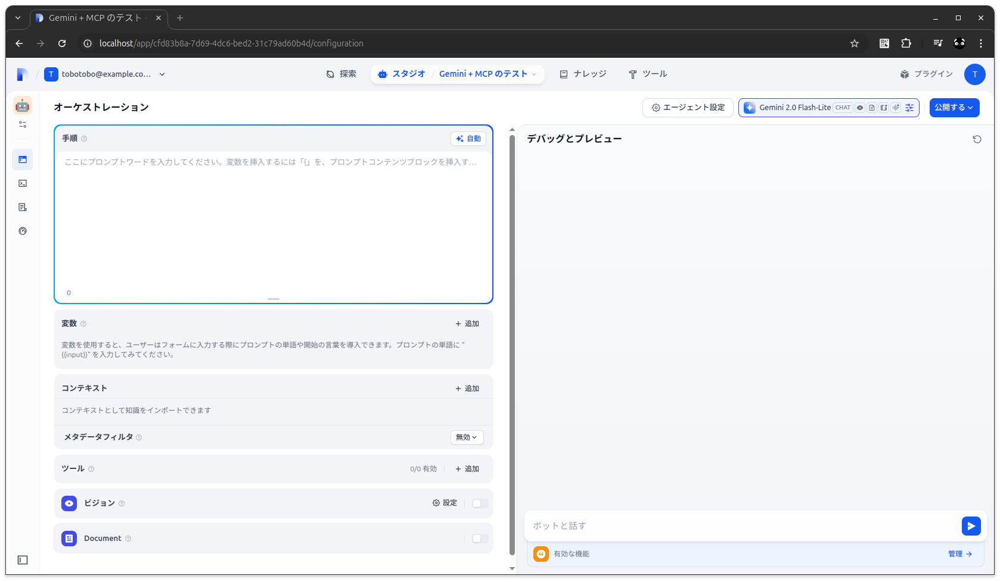
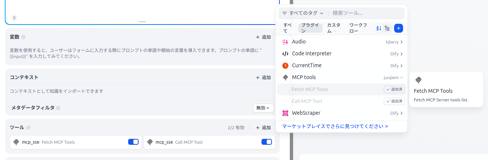
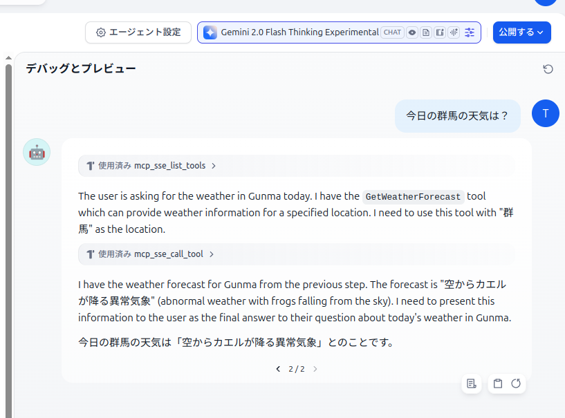
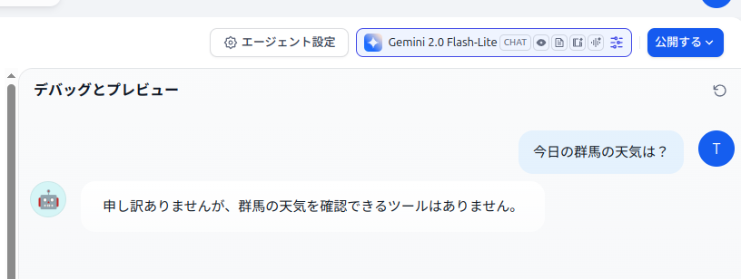

# dotnet_mcp_study2

## 概要
* Kazuki Ota さんの「[.NET で MCP サーバー・クライアントを試してみよう](https://zenn.dev/microsoft/articles/semantickernel-mcp)」の記事を 2025/5/6 時点のバージョンで再実装してみる
* 作成した MCP サーバーを Microsoft.SemanticKernel + Gemini から呼び出してみる
* 作成した MCP サーバーを Dify + MCP SSE から呼び出してみる

.NET で MCP サーバー・クライアントを試してみよう  
https://zenn.dev/microsoft/articles/semantickernel-mcp  

nuget - ModelContextProtocol.AspNetCore  
https://www.nuget.org/packages/ModelContextProtocol.AspNetCore  

MCP C# SDK  
https://github.com/modelcontextprotocol/csharp-sdk  

MCP C# SDK - Samples  
https://github.com/modelcontextprotocol/csharp-sdk/tree/main/samples

## 目次
* [環境](#環境)
* [各種バージョン](#各種バージョン)
* [詳細](#詳細)
  * [MCP サーバーの実装](#mcp-サーバーの実装)
  * [MCP クライアントの実装](#mcp-クライアントの実装)
  * [実行](#実行)
  * [サーバー側の戻り値をオブジェクトにしてみる](#サーバー側の戻り値をオブジェクトにしてみる)
  * [AIっぽさを足す ※Gemini](#aiっぽさを足す-gemini)
  * [Dify + MCP SSE で呼び出してみる](#dify--mcp-sse-で呼び出してみる)

## 環境
```
$ cat /etc/os-release 
PRETTY_NAME="Ubuntu 24.04.2 LTS"
$ dotnet --version
8.0.400
```

## 各種バージョン
AI 関連のツールやパッケージは発展途上で変化が激しく、同じコードが新しいバージョンで動くとは限らないので注意

* ModelContextProtocol: 0.1.0-preview.11
* ModelContextProtocol.AspNetCore: 0.1.0-preview.11
* ModelContextProtocol-SemanticKernel: 0.0.1-preview-10 
* Microsoft.SemanticKernel: 1.47.0
* Microsoft.SemanticKernel.Connectors.Google: 1.47.0-alpha
* Dify: 1.3.1
* MCP SSE / StreamableHTTP: 0.1.4

## 詳細

### MCP サーバーの実装

```sh
dotnet new webapi --no-https --no-openapi -n MCPServerLab
```

#### `Program.cs` から `WeatherForecast` 関連のコードを削除
```cs
var builder = WebApplication.CreateBuilder(args);

var app = builder.Build();

app.Run();
``` 

#### NuGet で AspNetCore 用の MCP パッケージ追加
```sh
dotnet add MCPServerLab package ModelContextProtocol.AspNetCore --prerelease
```
※0.1.0-preview.11

#### `Program.cs` に対応するコードを追加
MCP C# SDK の AspNetCoreSseServer のサンプルをベースに Kazuki さんの WeatherForecastTool をガッチャンコ 

MCP C# SDK - Samples - AspNetCoreSseServer  
https://github.com/modelcontextprotocol/csharp-sdk/blob/main/samples/AspNetCoreSseServer

```cs
using System.ComponentModel;
using ModelContextProtocol.Server;

var builder = WebApplication.CreateBuilder(args);

builder.Services.AddMcpServer()
    .WithHttpTransport()
    .WithTools<WeatherForecastTool>();

var app = builder.Build();

app.MapMcp();

app.Run();

// 天気予報を取得するツール
[McpServerToolType, Description("天気予報を取得するツール")]
class WeatherForecastTool
{
    [McpServerTool, Description("指定した場所の天気予報を返します。")]
    public static string GetWeatherForecast(
        [Description("天気を取得したい場所の名前")]
        string location) => location switch
    {
        "東京" => "晴れ",
        "大阪" => "曇り",
        "札幌" => "雪",
        _ => "空からカエルが降る異常気象",
    };
}
```

#### `launchSettings.json` を変更
MCPServerLab/Properties/launchSettings.json
```json
{
  "$schema": "http://json.schemastore.org/launchsettings.json",
  "profiles": {
    "http": {
      "commandName": "Project",
      "dotnetRunMessages": true,
      "applicationUrl": "http://0.0.0.0:5000",
      "environmentVariables": {
        "ASPNETCORE_ENVIRONMENT": "Development"
      }
    }
  }
}
```

### MCP クライアントの実装

```sh
dotnet new console -n MCPClientLab
```
```sh
dotnet add MCPClientLab package ModelContextProtocol --prerelease
```
MCPClientLab/Program.cs
```cs
using ModelContextProtocol.Client;
using ModelContextProtocol.Protocol.Transport;

var clientTransport = new SseClientTransport(new()
{
    Name = "天気予報",
    Endpoint = new Uri("http://0.0.0.0:5000/sse")
});

await using var client = await McpClientFactory.CreateAsync(clientTransport);

// ツールの一覧を取得
var tools = await client.ListToolsAsync();
foreach (var tool in tools)
{
    Console.WriteLine($"{tool.Name}: {tool.JsonSchema}");
}

// GetWeatherForecast ツールを取得
var getWeatherForecastTool = tools.FirstOrDefault(t => t.Name == "GetWeatherForecast")
    ?? throw new InvalidOperationException();

// GetWeatherForecast ツールを実行
var response = await client.CallToolAsync(getWeatherForecastTool.Name, new Dictionary<string, object?>
{
    // ["location"] = "東京",
    ["location"] = "群馬",
});

// レスポンスを表示
foreach (var content in response.Content)
{
    Console.WriteLine($"{content.Type}, {content.Text}");
}
```

### 実行
#### サーバー起動
```sh
dotnet run --project MCPServerLab
```
実行結果
```sh
$ dotnet run --project MCPServerLab
ビルドしています...
info: Microsoft.Hosting.Lifetime[14]
      Now listening on: http://0.0.0.0:5000
info: Microsoft.Hosting.Lifetime[0]
      Application started. Press Ctrl+C to shut down.
info: Microsoft.Hosting.Lifetime[0]
      Hosting environment: Development
info: Microsoft.Hosting.Lifetime[0]
      Content root path: /home/tobotobo/Desktop/projects/dotnet_mcp_study2/MCPServerLab
```

#### クライアント起動
別のコンソールから以下を実行
```sh
dotnet run --project MCPClientLab
```
実行結果
```sh
$ dotnet run --project MCPClientLab
GetWeatherForecast: {"title":"GetWeatherForecast","description":"\u6307\u5B9A\u3057\u305F\u5834\u6240\u306E\u5929\u6C17\u4E88\u5831\u3092\u8FD4\u3057\u307E\u3059\u3002","type":"object","properties":{"location":{"description":"\u5929\u6C17\u3092\u53D6\u5F97\u3057\u305F\u3044\u5834\u6240\u306E\u540D\u524D","type":"string"}},"required":["location"]}
text, 空からカエルが降る異常気象
```

## サーバー側の戻り値をオブジェクトにしてみる

### サーバー

```sh
dotnet new webapi --no-https --no-openapi -n MCPServerLabObjReturn
```
```sh
dotnet add MCPServerLabObjReturn package ModelContextProtocol.AspNetCore --prerelease
```

MCPServerLabObjReturn/Program.cs
```cs
using System.ComponentModel;
using ModelContextProtocol.Server;

var builder = WebApplication.CreateBuilder(args);

builder.Services.AddMcpServer()
    .WithHttpTransport()
    .WithTools<WeatherForecastTool>();

var app = builder.Build();

app.MapMcp();

app.Run();

// 天気予報を取得するツール
[McpServerToolType, Description("天気予報を取得するツール")]
class WeatherForecastTool
{
    [McpServerTool, Description("指定した場所の天気予報を返します。")]
    public static WeatherForecast GetWeatherForecast(
        [Description("天気を取得したい場所の名前")]
        string location) => location switch
    {
        "東京" => new(location, "晴れ"),
        "大阪" => new(location, "曇り"),
        "札幌" => new(location, "雪"),
        _ => new(location, "空からカエルが降る異常気象"),
    };
}

record WeatherForecast(
    [property: Description("場所")]
    string Location,
    [property: Description("天気予報")]
    string Forecast);
```

MCPServerLabObjReturn/Properties/launchSettings.json
```json
{
  "$schema": "http://json.schemastore.org/launchsettings.json",
  "profiles": {
    "http": {
      "commandName": "Project",
      "dotnetRunMessages": true,
      "applicationUrl": "http://0.0.0.0:5000",
      "environmentVariables": {
        "ASPNETCORE_ENVIRONMENT": "Development"
      }
    }
  }
}
```

### クライアント

```sh
dotnet new console -n MCPClientLabObjReturn
```
```sh
dotnet add MCPClientLabObjReturn package ModelContextProtocol --prerelease
```

MCPClientLabObjReturn/Program.cs
```cs
using System.Text.Json;
using ModelContextProtocol.Client;
using ModelContextProtocol.Protocol.Transport;

var clientTransport = new SseClientTransport(new()
{
    Name = "天気予報",
    Endpoint = new Uri("http://localhost:5000/sse")
});

await using var client = await McpClientFactory.CreateAsync(clientTransport);

// ツールの一覧を取得
var tools = await client.ListToolsAsync();
foreach (var tool in tools)
{
    Console.WriteLine($"{tool.Name}: {tool.JsonSchema}");
}

// GetWeatherForecast ツールを取得
var getWeatherForecastTool = tools.FirstOrDefault(t => t.Name == "GetWeatherForecast")
    ?? throw new InvalidOperationException();

// GetWeatherForecast ツールを実行
var response = await client.CallToolAsync(getWeatherForecastTool.Name, new Dictionary<string, object?>
{
    // ["location"] = "東京",
    ["location"] = "群馬",
});

// レスポンスを表示
foreach (var content in response.Content)
{
    var r = JsonSerializer.Deserialize<Dictionary<string, object?>>(content.Text ?? "{}")!;
    foreach (var (key, value) in r)
    {
        Console.WriteLine($"{key}: {value}");
    }
}
```

### 実行① MCPServerLabObjReturn + MSCClientLab
→　戻り値が object + JSON 形式 ※日本語がエンコードされている

#### サーバー起動
```sh
dotnet run --project MCPServerLabObjReturn
```

#### クライアント起動
別のコンソールから以下を実行
```sh
dotnet run --project MCPClientLab
```
実行結果
```sh
$ dotnet run --project MCPClientLab
GetWeatherForecast: {"title":"GetWeatherForecast","description":"\u6307\u5B9A\u3057\u305F\u5834\u6240\u306E\u5929\u6C17\u4E88\u5831\u3092\u8FD4\u3057\u307E\u3059\u3002","type":"object","properties":{"location":{"description":"\u5929\u6C17\u3092\u53D6\u5F97\u3057\u305F\u3044\u5834\u6240\u306E\u540D\u524D","type":"string"}},"required":["location"]}
text, {"location":"\u7FA4\u99AC","forecast":"\u7A7A\u304B\u3089\u30AB\u30A8\u30EB\u304C\u964D\u308B\u7570\u5E38\u6C17\u8C61"}
```

### 実行② MCPServerLabObjReturn + MSCClientLabObjReturn
→　戻り値が object + JSON 形式 ※日本語がデコードされている

#### サーバー起動
```sh
dotnet run --project MCPServerLabObjReturn
```

#### クライアント起動
別のコンソールから以下を実行
```sh
dotnet run --project MCPClientLabObjReturn
```
実行結果
```sh
$ dotnet run --project MCPClientLabObjReturn
GetWeatherForecast: {"title":"GetWeatherForecast","description":"\u6307\u5B9A\u3057\u305F\u5834\u6240\u306E\u5929\u6C17\u4E88\u5831\u3092\u8FD4\u3057\u307E\u3059\u3002","type":"object","properties":{"location":{"description":"\u5929\u6C17\u3092\u53D6\u5F97\u3057\u305F\u3044\u5834\u6240\u306E\u540D\u524D","type":"string"}},"required":["location"]}
location: 群馬
forecast: 空からカエルが降る異常気象
```

## AIっぽさを足す ※Gemini

セマンティックカーネル：MCPの開始  
https://qiita.com/axzxs2001/items/0d244f1d07e9672644cc  

ModelContextProtocol-SemanticKernel  
https://github.com/StefH/McpDotNet.Extensions.SemanticKernel  

```sh
dotnet new console -n MCPClientLabGemini
```
```sh
dotnet add MCPClientLabGemini package Microsoft.SemanticKernel --version 1.47.0
dotnet add MCPClientLabGemini package Microsoft.SemanticKernel.Connectors.Google --version 1.47.0-alpha
dotnet add MCPClientLabGemini package ModelContextProtocol-SemanticKernel --version 0.0.1-preview-10
dotnet add MCPClientLabGemini package Microsoft.Extensions.Logging.Debug
```
※バージョンの組み合わせによっては動作しないので注意  
Microsoft.SemanticKernel 1.48 と ModelContextProtocol-SemanticKernel 0.0.1-preview-10 では動作せず。1.47 に下げると動作した。

MCPClientLabGemini/Program.cs
```cs
#pragma warning disable SKEXP0070

using Microsoft.Extensions.DependencyInjection;
using Microsoft.Extensions.Logging;
using Microsoft.SemanticKernel;
using Microsoft.SemanticKernel.Connectors.Google;
using ModelContextProtocol.SemanticKernel.Extensions;

var builder = Kernel.CreateBuilder();
builder.Services.AddLogging(c => c.AddDebug().SetMinimumLevel(LogLevel.Trace));

builder.Services.AddGoogleAIGeminiChatCompletion(
    serviceId: "gemini",
    modelId: "gemini-2.0-flash-lite",
    // modelId: "gemini-2.5-pro-exp-03-25",
    apiKey: Environment.GetEnvironmentVariable("GEMINI_API_KEY")!);

var kernel = builder.Build();

await kernel.Plugins.AddMcpFunctionsFromSseServerAsync("WeatherForecast", "http://localhost:5000/sse");

var executionSettings = new GeminiPromptExecutionSettings
{
    Temperature = 0,
    // FunctionChoiceBehavior = FunctionChoiceBehavior.Auto(),
    ToolCallBehavior = GeminiToolCallBehavior.AutoInvokeKernelFunctions
};

var prompt = "今日の群馬の天気は？";
var result = await kernel.InvokePromptAsync(prompt, new(executionSettings)).ConfigureAwait(false);
Console.WriteLine($"\n\n{prompt}\n{result}");
```

### 実行

#### サーバー起動
```sh
dotnet run --project MCPServerLabObjReturn
```

#### クライアント起動
別のコンソールから以下を実行
```sh
export GEMINI_API_KEY=XXXXXXXXXXXXXXX
```
```sh
dotnet run --project MCPClientLabGemini
```
実行結果
```sh
$ dotnet run --project MCPClientLabGemini
今日の群馬の天気は？
群馬の天気は空からカエルが降るという異常気象です。
```

## Dify + MCP SSE で呼び出してみる

MCP SSE / StreamableHTTP  
https://marketplace.dify.ai/plugins/junjiem/mcp_sse  

### プラグインから MCP SSE をインストール



#### サーバー起動
```sh
dotnet run --project MCPServerLabObjReturn
```

#### 認証する から接続情報を設定
  
```json
{"天気予報":{"transport":"sse","url":"http://192.168.1.11:5000/sse"}}
```
※IP アドレスは環境に合わせて変更してください。
  
  

※サーバー起動しないまま保存を押すと接続エラーになるので注意



### アプリをエージェントで作成
※エージェントで作成すること  
チャットボットだとツールの設定が無く MCP SSE が使えないので注意

  
  

#### ツールに MCP SSE を追加



#### モデルを選択してテスト実行

モデルには Thinking モデルを指定すること



Thinking モデルを指定しないと以下のようになる

  